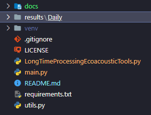

# Long Time Ecoacoustic Processing Tools

The Long Time Ecoacoustic Processing Tools repository is a collection of code and tools for processing and analyzing 
ecoacoustic data over long time durations.To access the documentation for the developed tools, 
please click [here](./docs/tools.md). In case you don't have files to use with the tools in this repository, we have 
provided sample files to test the `main.py` code, which calls some methods to execute and generate results. Refer to the 
**How to Run the main.py Code** section for more details.

## Requirements
- Python 3.9.x or higher installed

## How to Run the main.py Code

After cloning the repository to your machine:
- Download the `Daily` folder containing the DailyPxx files [here]()
- Create a folder named `results` in the root of the repository
- Add the `Daily` folder to the `results` folder

  **Creating a virtual environment**
    - If you don't have the `virtualenv` package installed for Python, run `pip install virtualenv`
    - Create a virtual environment with the command `virtualenv venv`
    - Activate your virtual environment with the command `source venv/bin/activate` (Linux or macOS) or `venv/Scripts/Activate` (Windows)
    - With the virtual environment activated, run `pip install -r requirements.txt`

- After all you will have the repository folder as follows:

- Finally, to execute the `main.py` file, run `python main.py`

Note: If you encounter any issues or errors during setup or execution, please refer to the project's documentation or reach out to the project maintainers for assistance.

